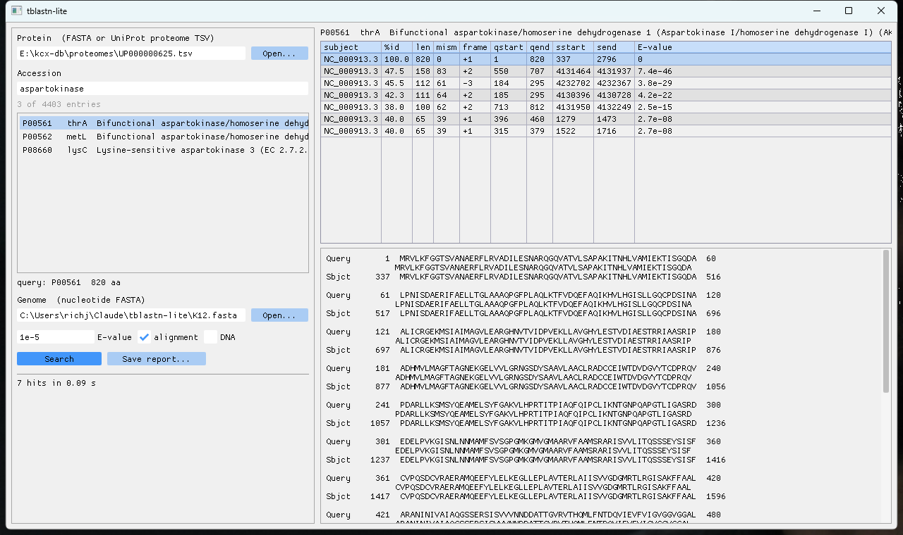

# tblastn-lite

Find the DNA that encodes a protein. No dependencies, no database build step, no
BLAST install: point it at a protein FASTA and a nucleotide FASTA and it does a
6-frame translated search. Ships as a command-line tool and a Dear ImGui window,
both over one header of search code.

820-aa protein vs the whole *E. coli* K-12 genome (4.6 Mb): **0.18 s** on 8 threads.

## Get it

Windows: grab the `.exe` files from [the latest release](https://github.com/Peter-SV2/tblastn-lite/releases/latest) - statically linked, no install, no runtime, nothing to copy beside them.

- **`tblastn_gui.exe`** - double-click it. Open a protein file and a genome, find
  your protein by typing part of its accession, gene or name, press Search.
  Files given on the command line or dropped on the window are sorted into the
  right box by what is in them, not by which box you aimed at.
- **`tblastn_lite.exe`** - the same search without the window; with no arguments
  it prompts for the paths.

The alignment pane is a read-only text box, not a label: select any part of it
with the mouse, or Ctrl+A / Ctrl+C. **Copy report** puts the whole thing - table,
alignments, matching DNA - on the clipboard, and **Save report...** writes the
same bytes to a file.



## Build

The command-line tool is a header and a `.cpp`, and builds anywhere:

```bash
make            # or: g++ -O3 -std=c++17 -static -o tblastn_lite tblastn_lite.cpp -pthread
make test
```

The GUI is Dear ImGui on Win32 + Direct3D 11, so it is Windows-only and CMake
fetches ImGui at a pinned tag:

```bash
cmake -B build -DCMAKE_BUILD_TYPE=Release
cmake --build build --target check     # the self-check, no GPU and no window needed
cmake --build build                    # tblastn_gui.exe and tblastn_lite.exe
```

It does not spin: `WaitMessage` blocks until there is input, so an idle window
costs no CPU. It draws nothing while it is not asked to.

SmartScreen will warn about an unsigned download - *More info -> Run anyway*.

## Picking the protein

The protein can come from a FASTA, or straight from a **UniProt proteome TSV**
- the tab-separated export with `Entry` and `Sequence` columns. Whole proteomes
are the convenient unit to keep on disk, and picking a gene out of one by
accession beats cutting a FASTA by hand:

```bash
./tblastn_lite -q UP000000625.tsv -a P00561 -d genome.fna     # accession
./tblastn_lite -q UP000000625.tsv -a thrA   -d genome.fna     # or gene name
```

The file type is detected from its first character, columns are found by header
name rather than position (extra columns are ignored), and rows with no sequence
are skipped. Without `-a`, every entry in the file is searched in turn - fine for
a FASTA of a few proteins, slow for a 4,000-entry proteome.

In the GUI the same file goes in the **Protein** box and the search field under
it filters the entries as you type - accession, gene name or any word of the
description. Typing `aspartokinase` against the 4,403-entry *E. coli* proteome
leaves thrA, metL and lysC to choose between.

## Use

```bash
./tblastn_lite -q protein.faa -d genome.fna -e 1e-5
```

```
# tblastn-lite  db: K12.fasta (1 seqs, 4641652 bp)
# query: thrA_ecoli (820 aa)  hits: 12
# qid        sid          %id   len  mism  frame  qstart qend sstart  send    evalue    bits
thrA_ecoli   NC_000913.3  100.0 820  0     +1     1      820  337     2796    0         1902.7
thrA_ecoli   NC_000913.3  47.5  158  83    +2     550    707  4131464 4131937 7.4e-46   182.7
thrA_ecoli   NC_000913.3  45.5  112  61    -3     184    295  4232702 4232367 3.8e-29   127.2
```

Subject coordinates are 1-based on the plus strand; `sstart > send` means the
match is on the minus strand.

Add `--aln` for the alignment and `--dna` to print the matching DNA as FASTA —
that second one is usually the point:

```bash
./tblastn_lite -q protein.faa -d genome.fna -e 1e-20 --dna > gene_candidates.fna
```

| flag | default | meaning |
|------|---------|---------|
| `-q, --query` | – | protein FASTA, or a UniProt proteome TSV |
| `-a, --acc` | – | one entry by accession or gene name (default: all entries) |
| `-d, --db` | – | nucleotide FASTA (multiple sequences fine) |
| `-e, --evalue` | 10 | E-value cutoff |
| `-T, --thresh` | 13 | neighbourhood word threshold; **lower = more sensitive, slower** |
| `-X, --xdrop` | 16 | ungapped extension X-drop |
| `-t, --threads` | all cores | threads |
| `-m, --max` | 500 | max HSPs reported per query |
| `--aln` | off | print alignments |
| `--dna` | off | print matching DNA as FASTA |
| `--selftest` | – | built-in checks |

## How it works

Same recipe as the original BLAST, minus the parts you rarely need:

1. Index every 3-mer that scores ≥ `-T` against the query under BLOSUM62
   (the neighbourhood, not just exact words — that is where the sensitivity
   comes from).
2. Translate each subject sequence in all 6 frames, look every 3-mer up.
3. Extend each seed left and right without gaps until the score drops `-X`
   below its best; one HSP per diagonal.
4. Score with Karlin–Altschul (λ=0.318, K=0.134): `E = 2·m·n·2^-bits`.

Finds a 35%-substituted version of a query at E ≈ 1e-303, and its distant
paralogues at 1e-12.

## What it does not do

- **No gapped alignment.** HSPs are ungapped, so an indel splits a gene into
  two HSPs on adjacent diagonals. Fine for bacterial genomes and exact/near
  homologues; if you need gapped, composition-adjusted, frameshift-tolerant
  alignment, use NCBI `tblastn`.
- **No low-complexity (SEG) filter.** A query full of `PPPPQQQQ` will hit noise.
- **No spliced alignment.** Eukaryotic genes with introns give one HSP per exon.
- Sequences are held in memory (genome-sized is fine; don't feed it all of nt).

## Files

| file | what |
|------|------|
| `tblastn_core.h` | the whole search: translation, seeding, extension, statistics, formatting |
| `tblastn_lite.cpp` | command-line front end + `--selftest` |
| `tblastn_imgui.cpp` | the GUI: Win32 + D3D11 host loop and the ImGui panel |

`test/ecoli_5.tsv` is a five-row extract of UniProt proteome UP000000625
(*E. coli* K-12), used by the examples; UniProt data is CC BY 4.0.

## Test

```bash
make test
```

`--selftest` checks translation, reverse complement, the proteome-TSV reader
with its columns shuffled, and an end-to-end search for a protein planted in
random DNA on both strands - full-length recovery, and coordinates that round
-trip back to the planted bases.

It does not use `assert`. A CMake Release build defines `NDEBUG`, where an
assert-based check compiles to nothing and prints `selftest OK` without having
tested anything; `CHECK` is an `if` and a return, so it survives. Shifting the
minus-strand start by one base fails it in a Release build - which is the point,
because that is the build people run.

## Licence

MIT.
